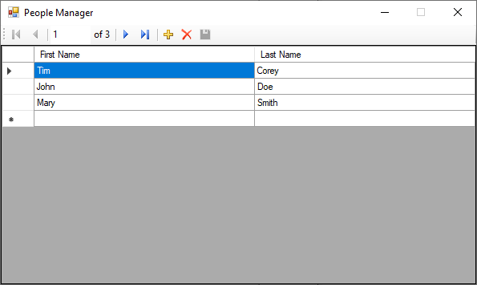
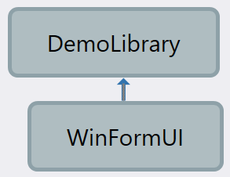
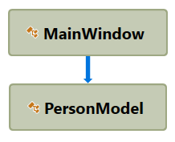

# SQLiteDemo example app

This lightweight WinForms app demonstrates using SQLite from C#.

**Figure 1.** Screen shot of app main window.

This app is my work while following along to the YouTube video

* [Using SQLite in C# - Building Simple, Powerful, Portable Databases for Your Application](https://www.youtube.com/watch?v=ayp3tHEkRc0)

**NOTE:** This app also utilizes the [PostSharp](https://www.postsharp.net/) application framework to provide logging and a `INotifyPropertyChanged` interface implementation without too much hassle.

## First iteration architecture

**Figure 2.** Architecture diagram of the project.

The first iteration of the app was to create a new Visual Studio Solution and add to two projects:

* `WinFormUI`: Windows Forms Application (.NET Framework) project type
    * The graphical user-interface of the app, this contains a small Windows Forms with a `DataGridView` that lets the user build a list of people.
* `DemoLibrary`: Class library (.NET Framework)
    * Class library containing the `PersonModel` class (that encapsulates the data for an individual person)
    * Contains the data-access logic

### `WinFormsUI` project

The project consists of a `Program` class to house the application's `Main` method, and a `MainWindow` form that serves as the main window of the application.

All the `MainWindow` does is maintain an in-memory data store which is an `ObservableCollection<PersonModel>`.  This data store is initialized by the main window's `LoadPeopleList` method and wired up to the `DataGridView` by the main window's `WireupPeopleList` method. 

**NOTE:** I realize that, in a commercial-grade app, the [Model-View-Presenter pattern](https://en.wikipedia.org/wiki/Model%E2%80%93view%E2%80%93presenter) would ordinarily be utilized in order to separate the data-management and display concerns; however, as this was written to follow a YouTube tutorial, I decided that that would be overkill.

#### Form UI specs

I am a strong believer in following the [UI/UX guidelines provided by Microsoft for Windows Desktop apps](https://docs.microsoft.com/en-us/windows/win32/uxguide/guidelines), so that there is a clean and consistent user experience between my apps and those that are already familiar to users.

Under said [guidelines](https://docs.microsoft.com/en-us/windows/win32/uxguide/win-window-frames), the app is known as a **top-level utility** since it is launched from an icon, has no documents or data files (except for configuration), and all the controls for interacting with data are displayed right away upon application start.  A _dialog-based application_ is also another terminology commonly applied to this sort of application.

For such apps, guidelines advise making the window have a thin border, with only a Minimize button (_) and a Close box (X).  To this end, we utilize the `FormBorderStyle.FixedSingle` constant for the main window's `FormBorderStyle` property, and we set the `MaximizeBox` property to `false` accordingly.  We also set the form's `StartPosition` property to `FormStartPosition.CenterScreen`, per guidelines.

To get the `DataGridView` housed within the app's main window to look aesthetically pleasing, we set the `AutoResizeColumnsMode` property of the `DataGridView` to `Fill`.  We also dock it in the parent container.

### `DemoLibrary` project

This project's purpose is to contain the data entities and data-access layer.

As this is an exceedingly simple sample, no business-logic layer is implemented; or, if business logic is present, it's integrated part-and-parcel into the `DemoLibrary` project.

Initially, when this sample was first written, all the `DemoLibrary` project does is house a definition of the `PersonModel` data entity class.  

The `DemoLibrary` project is then referenced by the `WinFormUI` project.

### Object dependencies

**Figure 3.** UML diagram showing the main object dependency relationships in the first iteration of the app.